# Tetrisly React

🧩 Simplify your React applications with Tetrisly! Designed for effortless integration, Tetrisly offers user-friendly components that will enhance your projects. Plus, it's fully compatible with Figma for a seamless design and development experience.

If you want to know more about Tetrisly, check out our website: [tetrisly.com](https://tetrisly.com/)

## Tech Stack

- [React 18](https://react.dev/)
- [xstyled](https://xstyled.dev/)

We've desided to use `xstyled` for styling our components. If you are interested in our reasoning, check out our article on this topic: [Style Wars: Tailwind vs. CSS-in-JS in Design Systems Implementation](https://medium.com/tetrisly/style-wars-tailwind-vs-css-in-js-in-design-systems-implementation-de6015ee2695)

## Installation

Install my-project with npm (you can do the same with yarn, pnpm or any other package manager)

```bash
  npm install @virtuslab/tetrisly-react
```

## Run Locally

Clone the project

```bash
  git clone https://github.com/VirtusLab/tetrisly-react
```

Go to the project directory

```bash
  cd tetrisly-react
```

Install dependencies

```bash
  yarn install
```

Start the storybook server

```bash
  yarn storybook
```

## Running Tests

To run tests, run the following command

```bash
  yarn test
```

## Documentation


If you want to dive deeper into the components Tetrisly offers, check out our official documentation: [Tetrisly Docs](https://docs.tetrisly.com/)

## Usage/Examples

```typescript
import { Button } from '@virtuslab/tetrisly-react';

function App() {
  return <Button label="Hello Tetrisly" />
}
```

## License

We are using the [Apache License 2.0](https://choosealicense.com/licenses/apache-2.0/) for our library of components
